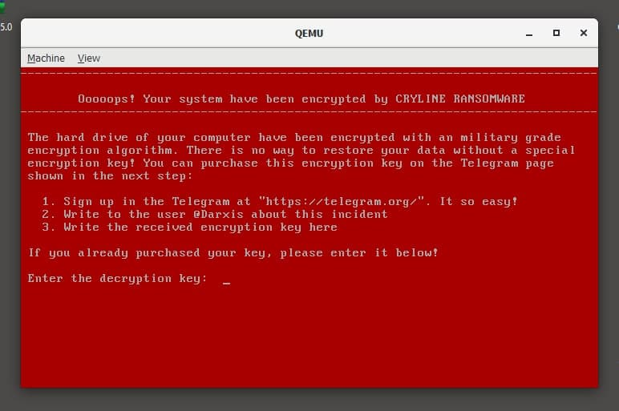
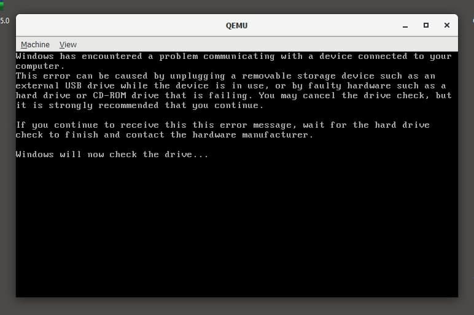

------------------
# INFORMATION #
------------------

##  Contact 
 * Email: darxis.exception@vfemail.net
 * Telegram: @Darxis
 * Jabber: Darxis@exploit.im
 * HackTheBox: https://www.hackthebox.eu/profile/37928
 
 
------------------

------------------

## Directories
+ ./BIN - Compiled files
+ ./SOURCE - Source code
+ ./TEST_DISK - Drive image
+ ./TOOLS - Compiler and additionally utilities
+ ./CRYLINE_COMPILER - Simple Windows command line script for autocompile
------------------

## Files
- ./SOURCE/encryptLoader.asm - First MBR
- ./SOURCE/driveEncryption.asm - Encryption module [THIS CIPHER IS VERY WEAK! It was used only for testing!]
- ./SOURCE/bannerLoader.asm - Second MBR
- ./SOURCE/bannerKernel.asm - Banner that is displayed after drive encryption
------------------

## Dropper
This's a simple malware for writing files to drive.
* First 512 bytes of hard drive - encryptLoader.bin
* Second 1024 bytes of hard drive - bannerKernel.bin
* Third 1024 bytes of hard drive - bannerLoader.bin
* Fourth 512 bytes of hard drive - bannerLoader.bin
------------------
